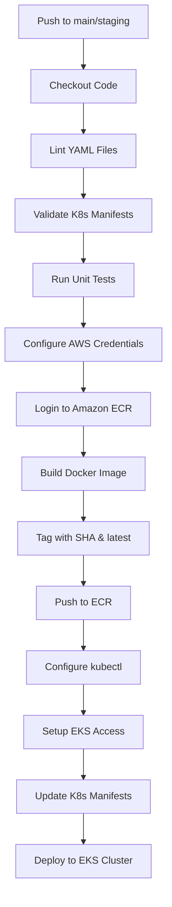

# Terraform Provisioning of Infrastructure

## Step 1: EKS Cluster and ECR Repository Creation

This guide outlines the steps to provision AWS infrastructure using Terraform, including:
- An Amazon EKS (Elastic Kubernetes Service) cluster
- An Amazon ECR (Elastic Container Registry) repository

### Prerequisites
Ensure you have the following:
- An AWS account with appropriate permissions
- Terraform v1.11.3 installed
- AWS CLI configured
- kubectl installed (for EKS interactions)
- IAM user with EKS/ECR permissions

---

### EKS Cluster

#### Purpose
The Amazon EKS cluster serves as the foundational infrastructure for deploying containerized applications. It is provisioned using Terraform with the following configurations:
- Default VPC network and subnets
- Managed node groups for worker nodes
- IAM service account roles
- Kubernetes version 1.32

---

### ECR Repository

#### Purpose
The Amazon Elastic Container Registry (ECR) is used to store Docker container images for deployment into the EKS cluster. It is configured with:
- Private image storage
- Image tag mutability enabled for development flexibility
- Repository access policies for deployment actions

---

### Usage Instructions

#### EKS Cluster Setup
1. Navigate to the `eks-cluster-setup-terraform` directory.
2. Initialize Terraform:
    ```bash
    terraform init
    ```
3. Review the execution plan:
    ```bash
    terraform plan
    ```
4. Apply the configuration:
    ```bash
    terraform apply
    ```

#### ECR Repository Setup
1. Navigate to the `ecr-repo-terraform` directory.
2. Initialize Terraform:
    ```bash
    terraform init
    ```
3. Review the execution plan:
    ```bash
    terraform plan
    ```
4. Apply the configuration:
    ```bash
    terraform apply
    ```

---

## CI/CD Pipeline: Deploy to Amazon EKS using GitHub Actions

This project uses GitHub Actions to automate the build, test, and deployment of a Node.js application to an **Amazon EKS cluster** when code is pushed to the `main` or `staging` branches.

### Workflow Overview


---

## Project Structure

```plaintext
├── .github/
│   └── workflows/
│       └── deploy.yml         # GitHub Actions pipeline
├── k8s/                       # Kubernetes manifests
│   ├── deployment.yaml        # Kubernetes Deployment
│   ├── service.yaml           # Kubernetes Service
│   ├── ingress.yaml           # Ingress Resource
│   ├── secret.yaml            # Kubernetes Secret
│   └── configmap.yaml         # Kubernetes ConfigMap
├── app/
│   ├── Dockerfile             # Docker build instructions
│   ├── package.json           # Node.js dependencies and scripts
│   └── server.js              # Entry point for Node.js app
└── README.md
```


